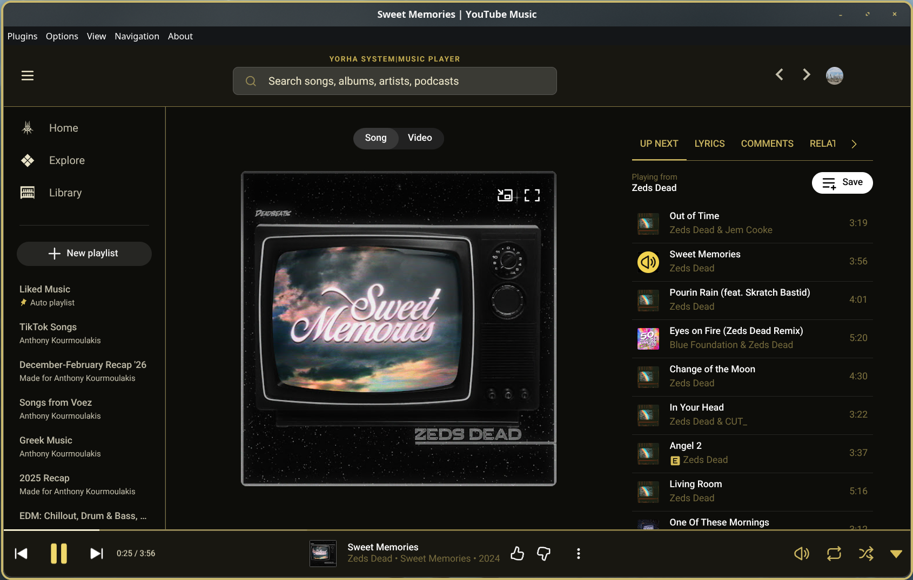

# NieR Automata Style Theme

A custom **NieR:Automata / YoRHa-inspired theme** for YouTube Music, designed primarily for **Pear Desktop**.

This theme uses a dark black-and-charcoal interface with warm ivory and muted yellow accents inspired by the visual language of NieR:Automata and YoRHa system interfaces.

## Features

- NieR:Automata-inspired black, ivory, gray, and yellow color palette
- Custom **YoRHa System | Music Player** header branding
- Custom YoRHa navigation icon for **Home**
- Custom quest-marker navigation icon for **Explore**
- Custom library navigation icon for **Library**
- Themed player controls and progress bar
- Matching sidebar, search, menus, headers, and player interface
- Support for Pear Desktop's current Bauhaus sidebar layout
- Responsive behavior for expanded and collapsed navigation

## Theme

### `NieR-Automata-Style-Theme.css`

The complete theme is contained in a single CSS file. Custom navigation artwork is embedded directly into the stylesheet, so no additional icon files are required.

---

## Installation

### Pear Desktop

1. Download `NieR-Automata-Style-Theme.css`.
2. Open **Pear Desktop**.
3. Open **Options**.
4. Navigate to:

   **Visual Tweaks → Theme → Import custom CSS file**

5. Select `NieR-Automata-Style-Theme.css`.
6. Restart Pear Desktop if the theme does not immediately refresh.

---

## Screenshots

---

## Credits

This project originated from my personal modifications to the **Eggplant** YouTube Music theme.

Based on CSS themes originally created by **OceanicSquirrel**.

A maintained collection of the original YouTube Music Desktop themes is available from **kerichdev's themes-for-ytmdesktop-player** project.

The NieR:Automata-inspired modifications, Pear Desktop compatibility updates, custom navigation styling, branding, and additional theme work are part of this project.

---

## Disclaimer

This is an unofficial fan-made theme.

NieR:Automata, YoRHa, and related names, logos, imagery, and trademarks are property of their respective owners. This project is not affiliated with or endorsed by Square Enix, PlatinumGames, or the NieR development team.
